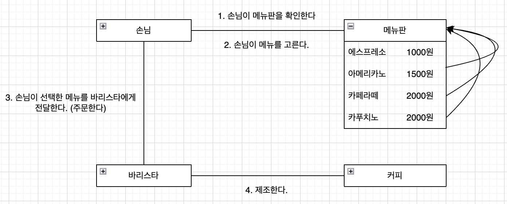
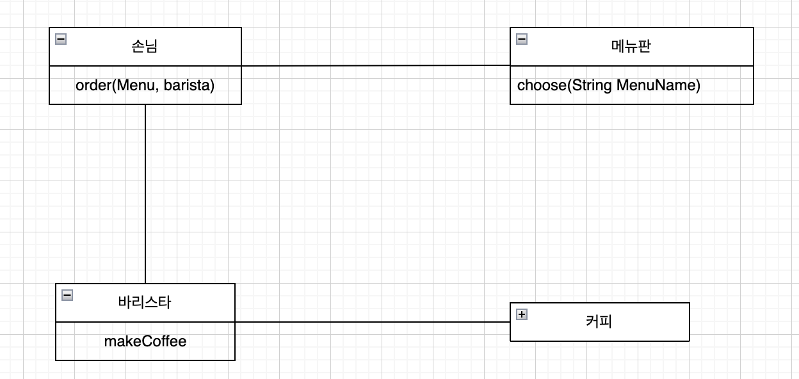

## 커피 전문점
### 커피 주문
- 커피 전문점에서는 아메리카노, 카푸치노, 카라멜 마키아또, 에스프레소의 네 가지 커피를 판매하고 있다. 
- `손님`은 카운터에서 주문을 할 수 있으며, 카운터에는 커피의 이름과 가격에 적힌 `메뉴판`이 비치되어 있다.
- 커피 주문을 받고 만드는 작업은 `바리스타`의 몫이다.

 

위 도메인 다이어그램을 기준으로 객체들의 협력 관계를 살펴보면 다음과 같다.
1. 손님은 메뉴판을 기준으로 메뉴를 선택한다. (menu.choose())
2. 손님은 선택한 메뉴를 바리스타에게 주문한다. (customer.order())
3. 바리스타는 주문받은 커피를 제조한다. (barista.makeCoffee())

이를 기준으로 클래스 다이어 그램을 그리면 다음과 같다.  

### 구현
1. 메뉴 클래스안에 메뉴 아이템이 포함된다. 
    - 이를 코드로 표현하면 Menu라는 클래스가 MenuItem 리스트를 가지고 있는것으로 표현할 수 있다.
    - MenuItems는 여러번 생성해서 쓸 필요가 없고, 중간에 동적으로 메뉴가 들어갈 일이 없기 때문에 static final로 선언하였다.
~~~java
public class Menu {
    private static final List<MenuItem> menuItems = List.of(
            new MenuItem("에스프레소", 1000),
            new MenuItem("아메리카노", 1500),
            new MenuItem("카페라떼", 2000),
            new MenuItem("카푸치노", 2000)
    );

    public static MenuItem choose(String name) {
        for (MenuItem menuItem : menuItems) {
            if(menuItem.getName().equals(name)) {
                return menuItem;
            }
        }
        return null;
    }
}
~~~

2. 손님
   - 손님은 메뉴를 선택한다.
   - 선택한 메뉴를 바리스타에게 만들어달라고 요청한다. 
~~~java
public class Customer {

    public void order(String menuName, Barista barista) {
        MenuItem item = Menu.choose(menuName);
        Coffee coffee = barista.makeCoffee(item);
        System.out.println("손님 : " + coffee.getName() + " 잘 먹겠습니다.");
    }
}
~~~

3. 바리스타
~~~java
public class Barista {

    public Coffee makeCoffee(MenuItem item) {
        Coffee coffee = new Coffee(item.getName(), item.getPrice());
        System.out.print("바리스타 : " + coffee.getName() + " 주문 받았습니다. ");
        System.out.println("가격은 " + coffee.getPrice() + " 입니다.");
        return coffee;
    }
}
~~~

4. 메뉴 아이템
    - 메뉴 이름과 가격의 상태를 갖는 객체이다.
~~~java
public class MenuItem {

    private final String name;
    private final int price;

    public MenuItem(String name, int price) {
        this.name = name;
        this.price = price;
    }

    public String getName() {
        return name;
    }

    public int getPrice() {
        return price;
    }
}
~~~

### 중간 정리
여기까지가 기본적인 객체지향을 설계하는 방법이다. 각각의 객체는 공동체이며 공동의 목적을 이루기 위해 협력하고 소통한다.
손님과 메뉴판의 협력, 손님과 바리스타의 협력, 바리스타와 커피의 협력을 볼 수 있었으며 이 협력을 요청하기 위해 '메소드 호출'을 이용하였다.

#### 리팩토링
V1을 마치기 전에 예외 상황에 대해 생각해보자.
1. 메뉴가 없을 수 있다.
    - 손님은 메뉴판을 보지 않고 헤이즐넛 아메리카노를 주문할 수 있다.
    - 이때, 기본처리가 null을 반환하는 것으로 되어 있다.
~~~java
public static MenuItem choose(String name) {
    for (MenuItem menuItem : menuItems) {
        if(menuItem.getName().equals(name)) {
            return menuItem;
        }
    }
    return null;
}
~~~

이를 위해 두 가지 방법을 시도해볼 수 있을 것 같다.
1. 프로그램적인 예외를 던진다. 
~~~java
public static MenuItem choose(String name) {
    for (MenuItem menuItem : menuItems) {
        if(menuItem.getName().equals(name)) {
            return menuItem;
        }
    }
    throw new IllegalArgumentException();
}
~~~

2. Optional을 이용하여 유동적인 Null처리를 한다.
~~~java
public static Optional<MenuItem> choose(String name) {
  for (MenuItem menuItem : menuItems) {
      if(menuItem.getName().equals(name)) {
          return Optional.of(menuItem);
      }
  }
  return Optional.empty();
}
~~~

여기서는 Optional로 추가적으로 할 수 있는 작업이 마땅히 생각나지 않아 간단하게 예외를 던지는 것으로 선택하였다.

### 정리
1. Menu 클래스를 interface 로 변환?
    - menuItem이라는 객체들을 들고 있으니까 추상화를 해야 한다고 생각했다. 그런데 객체 지향 세계에서 중요한 것은 협력 관계에서 어떤 책임과 역할을 맡고 행동하는지에 있다. 즉, Menu는 MenuItem을 보여주는 역할을 맡는다. MenuItem은 이름과 가격을 보여주는 역할을 맡는다. 즉, 이 둘을 서로의 역할이 다르기 때문에 
인터페이스의 분리는 의미가 없다는 것을 알았다.

2. 여기서 각 객체들은 내부적으로 어떻게 일이 이루어지는지 알 지 못한다.
    - 손님은 바리스타가 어떻게 커피를 만드는지 알 수 없다. 따라서 커피 제조 방법이 바뀌어도 손님에게 영향을 주지 않는다. 
    - 손님은 메뉴에 아이템이 어떻게 추가되는지 알 수 없다. 따라서 새로운 메뉴가 추가되어도 손님에게는 영향을 주지 않는다. (객체 지향적으로)
