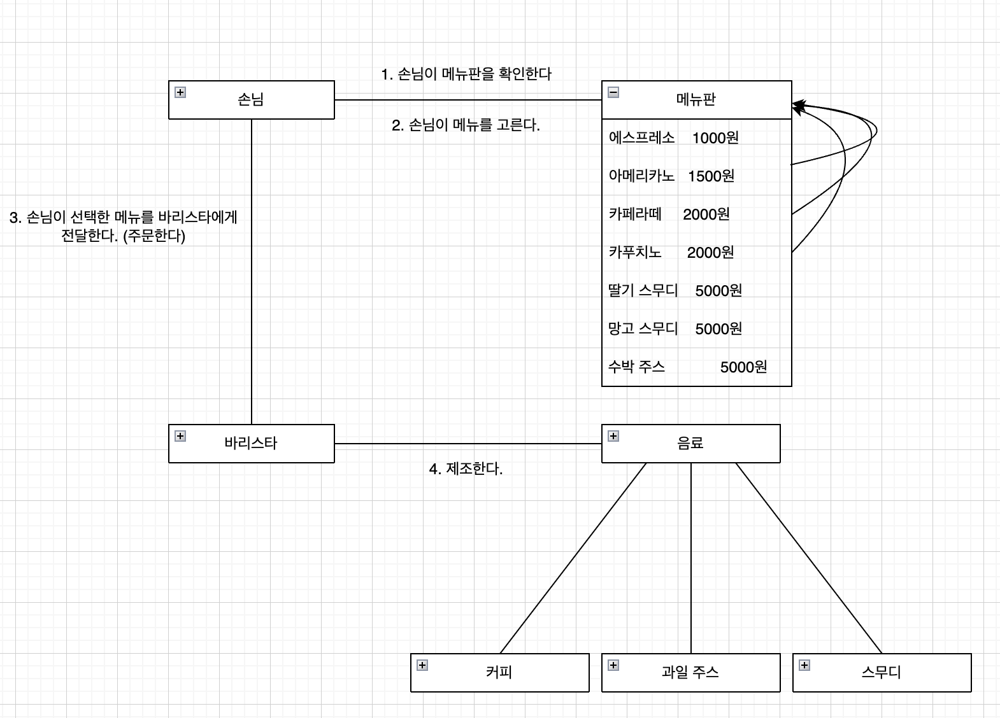

## v2 메뉴 추가

가게에 스무디, 과일 주스 메뉴가 추가되었다. 변화에 잘 대처할 수 있는 유연한 코드를 작성해보자.

- 메뉴판 입장에서는 자기가 가지고 있는 새로운 객체가 더 추가된 것일 뿐 큰 변화는 없다.
- 손님은 메뉴를 주문한다. 손님에게도 변화는 없다.
- 바리스타는 커피, 스무디, 과일을 제조한다. 즉, 제조한다는 행위 자체에는 변함이 없다.
따라서 추가할 메세지는 없어 보인다. 

### 추상화
커피, 과일 주스, 스무디 클래스를 작성해보자.
~~~java
class Coffee {
    private final String name;
    private final int price;
}

class FruitJuice {
    private final String name;
    private final int price;
}

class Smoothie {
    private final String name;
    private final int price;
}
~~~
'name'과 'price'라는 상태가 모두 중복이 된다. 이럴 때는 상위 클래스를 만들어 추상화를 해볼 수 있다.

~~~java
class Beverage {
    private final String name;
    private final int price;
    
    Beverage(String name, int price) {
        this.name = name;
        this.price = price;
    }
}

class Juice extends Beverage {
    FruitJuice(String name, int price) {
        super(name, price);
    }
}

public class Coffee extends Beverage {
    public Coffee(String name, int price) {
        super(name, price);
    }
}
~~~
이렇게 작성하고 보니 Juice, Coffee 클래스가 모두 동일하다. 그렇다면 Beverage라는 일반화된 클래스만 남기는 것이 좋아보인다. 

자 이제 스무디도 주문해보자.
~~~java
public class Main {

    public static void main(String[] args) {
        Barista barista = new Barista();

        Customer customer = new Customer();
        customer.order("에스프레소", barista);
        customer.order("딸기 스무디", barista);
    }
}
~~~
- 메뉴판에 메뉴가 추가되었지만 고객이 메뉴를 주문하는 로직에는 변화가 없다.
- 바리스타는 제조한다는 책임과 역할을 가지고 있다. 단지, 스무디와 쥬스처럼 만들 항목이 늘어난 것이다. 이는 간단하게 Coffee라는 클래스를 Beverage로 바꿈으로써 해결할 수 있다.
~~~java
public class Barista {

    public Beverage makeBeverage(MenuItem item) {
        Beverage beverage = new Beverage(item.getName(), item.getPrice());     // 이 부분만 바뀌었다.
        System.out.print("바리스타 : " + beverage.getName() + " 주문 받았습니다. ");
        System.out.println("가격은 " + beverage.getPrice() + " 입니다.");
        return beverage;
    }
}
~~~