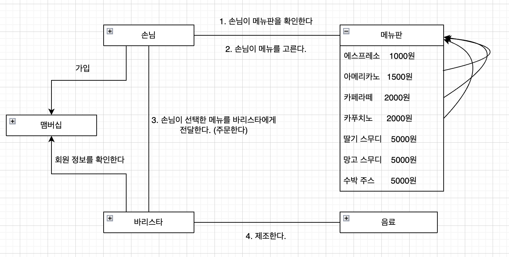

### V3 VIP 맴버쉽 서비스 도입
맴버쉽 서비스를 도입하고자 한다.
 - 멤버십은 비용은 매달 5000원이며, 고객이 인터넷을 통해 스스로 가입해야 한다.
 - VIP 회원은 음료 구입시 음료의 10%를 할인 받는다.
 - 중복된 회원이름은 없다고 가정한다.

- 멤버쉽과 멤버의 관계는 V1에서 설계한 메뉴판과 메뉴아이템의 관계와 비슷하다. 즉, 맴버는 맴버쉽안에 있는 각각의 객체들이다.
    